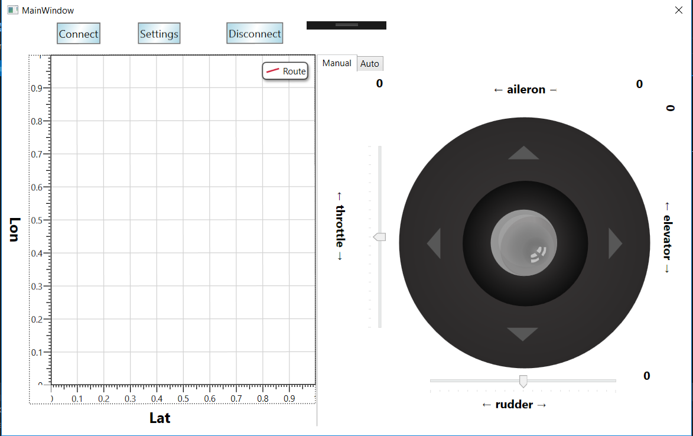
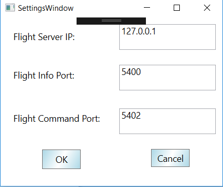
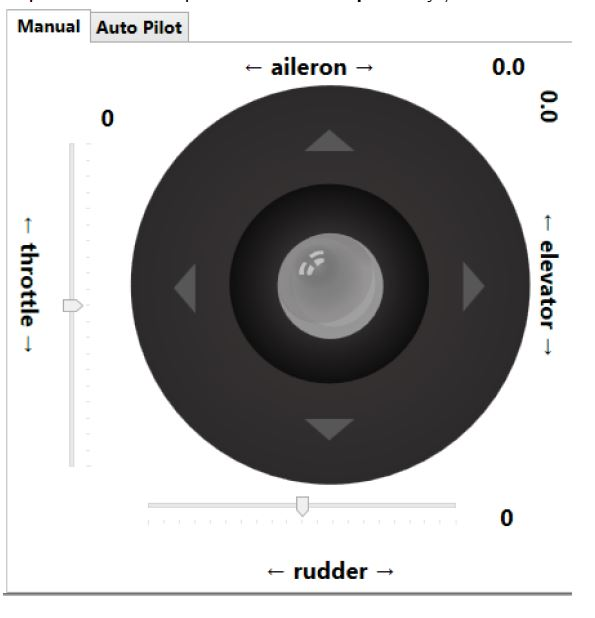
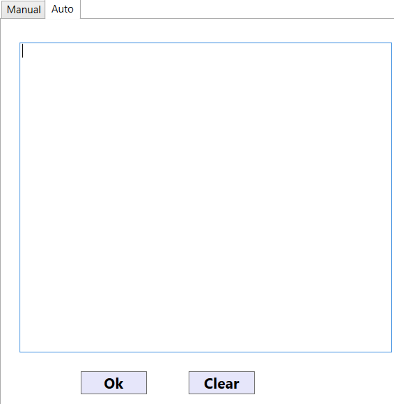

# FlightGear-Simulator-Desktop-App
A desktop application for the FlightGear flight simulator, used to fly the aircraft using either a joystick or a stream of commands.
Implmented using WPF technology and MVVM architecture.

## App windows
the main window will be presented:



On the left, you can see the movement of the pkan (lontitude and latitude). On the right, you can control the movement.
you can change the lon and lat manualy with the joistick or you can do it automatic, with ordering orders.

## Preparing to lift off
a. First, you may need to adjust the time in the simulator from nighttime to daytime in order to see clearly. Click on the Environment tab in the toolbar shown below, and click on Time Settings. Adjust the time to your liking.
b. Next, in order to help you speed things up and bypass the take-off procedures, click on the Cessna C172P tab, and click on Autostart. This will start the engine and prepare the aircraft to lift off.

## Flying the aircraft
### connecting 
Run the application and click on the 'Settings' button and a new window will pop up:



Here you config the settings to connect to the simulator. The default settings will appear. You can change these settings to your liking.

## Controlling the aircraft
The aircraft can be controlled using either a joystick (manual) or a stream of commands (auto). You can change between the two by clicking the 'manual' and 'auto' tabs in the right side of the window.

### Manual control
The joystick is used to navigate the aircraft. Shifting the rod changes the values presented in the display and sends them to the simulator.



### Auto control
Click on the 'Auto' tab to switch to the auto control. Here you write commands in a specific format the simulator can read and apply:



You can add a strim of commands and after you finish click on 'OK'. for exmpal:
```
set controls/flight/rudder -1
```

